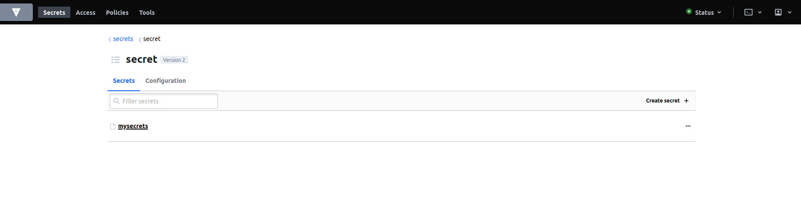
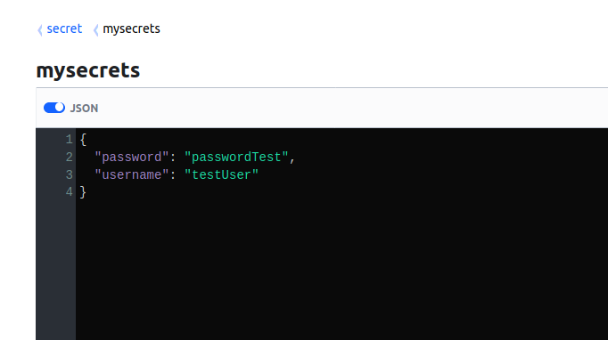
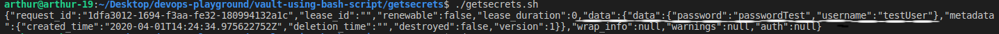

# Vault

### This is a very simple POC, to run this you just need to install Vault

* After install, start the server with the command
    > vault server -dev

* Open another terminal and execute:
    > export VAULT_ADDR='http://127.0.0.1:8200'

* Copy the ``Root token`` that was given to you when started the server

* On your browser access: ``http://127.0.0.1:8200``

* Login with the root token, no you are in the Vault interface you don`t need to do anything by now, you will use this interface just to check if the script worked

* Let postsecret.sh be executable with:
    > sudo chmod +x postsecret.sh

* Execute the script ( `` ./postsecret.sh {root token here}`` ) and on the interface access ``secret`` and there should be a secret with the name ``mysecrets``, open it and will have a username and a password (both are the same from the json file on the folder postsecret)

* Now to get back this secret, let getsecret.sh be executable
    > sudo chmod +x getsecret.sh

* Execute it and you will receive a json on the terminal with the secret, like the image below

